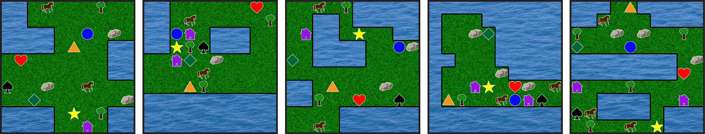
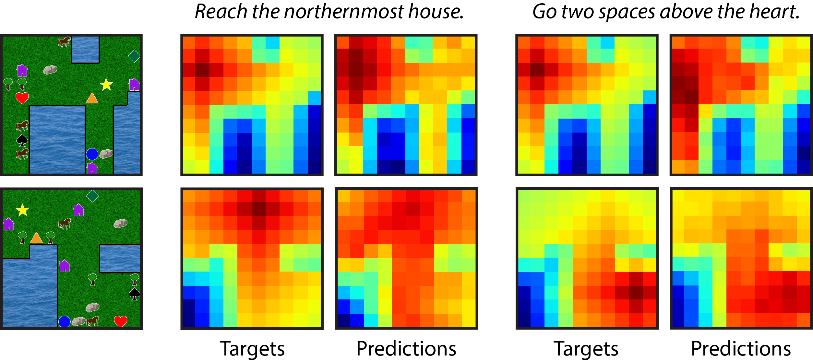

# Spatial Reasoning
Code and data to reproduce the experiments in [Representation Learning for Grounded Spatial Reasoning](https://arxiv.org/abs/1707.03938).

## Installation
Get [PyTorch](http://pytorch.org/) and `pip install -r requirements`

`./download_data.sh` to get the annotated map data and sprites to make new maps.

<b>Note:</b> There were a few <a href="https://github.com/pytorch/pytorch/releases/tag/v0.2.0">breaking changes</a> in the latest PyTorch release that affected this repo. Make sure you are using v0.2.0+ (`torch.__version__` to check)

## Data
We have collected human annotations of 3308 goals in 10x10 maps, specified by referencing one or more of 12 object types placed randomly in the world. To load up to `max_train` train maps and `max_val` val maps with `mode = [ local | global ]` instructions and `annotations = [ human | synthetic ]` descriptions, run:
``` 
>>> import data
>>> train_data, val_data = data.load(mode, annotations, max_train, max_val)
>>> layouts, objects, rewards, terminal, instructions, values, goals = train_data
```
where `layouts` and `objects` are arrays with item identifiers, `rewards` and `terminal` are arrays that can be used to construct an MDP, `instructions` are a list of text descriptions of the coordinates in `goals`, and `values` has the ground truth state values from Value Iteration.

To generate more maps (with synthetic annotations):
```
$ python generate_worlds.py --mode [ local | global ] --save_path data/example_worlds/ --vis_path data/example_env/
```
which will save pickle files that can be loaded with `data.load()` in `data/example_worlds/` and visualizations in `data/example_env/`. Visualizations of a few of the maps downloaded to `data/local/` are in `data/local_sprites/`.

<p align="center">
    
</p>
<p align="center">
    <em> Visualizations of randomly generated worlds </em>
</p>

## Training

To train the model with reinforcement learning:
```
$ python reinforcement.py --annotations [ human | synthetic ] --mode [ local | global ] --save_path logs/trial/
```

This will save the model, pickle files with the predictions, and visualizations to `logs/trial/`. 

To train the models in a supervised manner for the representation analysis, run `python representation.py` with the same arguments as above.

<p align="center">
    
</p>
<p align="center">
<em> Predicted values for two maps with two instructions each. In the first map, the instructions share no objects but refer to the same location. In the second map, the instructions refer to different locations.
</em>
</p>

## Acknowledgments
A huge thank you to <a href="http://people.eecs.berkeley.edu/~dfried/">Daniel Fried</a> and <a href="https://web.mit.edu/jda/www/">Jacob Andreas</a> for providing a copy of the human annotations when the original Dropbox link was purged.


